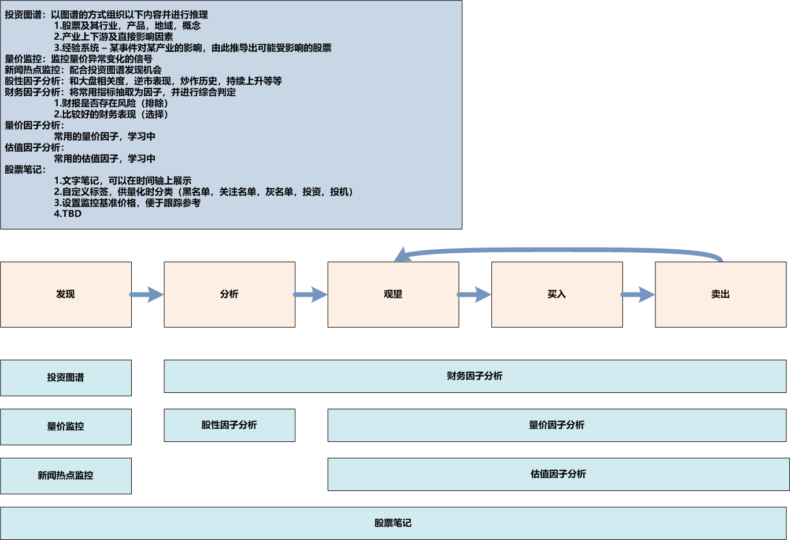

# StockAnalysisSystem
This program is designed for Chinese market and Chinese accounting policies (currently). So this document will only provide Chinese version.
  
# Gitee
https://gitee.com/SleepySoft/StockAnalysisSystem  
  
# Github
https://github.com/SleepySoft/StockAnalysisSystem  
  
# 网盘下载：
应网友要求，对于网络访问受限的用户，提供网盘下载（离线数据同样在此下载）：  
链接：https://pan.baidu.com/s/1H-viluqOoKrKRNJJmU17jg  
提取码：4r3u  
  
# 视频讲解
安装配置：https://www.bilibili.com/video/BV14z411b7AE/  
设计与框架：https://www.bilibili.com/video/BV1nK411p7uD/
  
# 最近更新内容：
* 从vnpy移植K线图表，重做Stock Memo功能  
  
* 更新相应文档  
  
# 更新计划：
  
* 加入更多常用的因子  
* 接入更多的数据（暂时还是从TS来）  
  
# 联系作者
如果有任何意见及建议，或者对此项目感兴趣的，请联系我：  
微博：SleepySoft  
邮箱：sleepysoft##163.com  
QQ群：931499339，进群验证码：SleepySoft  
如果遇到BUG，可以给我发邮件，或直接在git上提交issue  
  
----------------------------------------------------------------------------------------------------------------------
  
# 股票分析系统（当前规划）
  

  
----------------------------------------------------------------------------------------------------------------------
  
# 本程序的目的：
1. 自动选择合适的数据抓取模块和数据源下载所需要的数据  
2. 数据抓取模块能够进行有效性检测，并且能够方便地扩充和替换，可以通过适配器接入其它的库  
3. 增加一个数据源以及将其本地化所需的代码应尽可能少  
4. 能进行离线分析  
5. 分析模块（策略模块）应该可以动态扩充和组合  
6. 最终能生成矩阵式excel报告：以证券为行，以分析方法为列，相交点为此分析方法对此证券的评分；最后一列为该证券的总分  
  
----------------------------------------------------------------------------------------------------------------------
  
# 使用方法及软件依赖与配置
  
### 不想运行，直接看结果  
* 打开analysis_report.xlsx  
  
### 从网盘下载打包好的程序  
* 需要安装MongoDB，但不需要安装额外的python库  
* 解压后直接运行main.exe  
* 程序第一次启动时，会自动检查配置并弹出配置界面，请按照提示填写即可；如果没有Ts Token，可以胡乱填写  
* 配置界面提供mongodb数据的一键导入功能（数据同样在网盘下载），请分别导入StockAnalysisSystem及StockDaily数据  
* 如果不导入数据，可以通过数据管理界面下载（耗时较长），这种情况下需要正确填写Ts Token）  
  
### 通过sas库运行程序  
* 安装sas库  
> pip install StockAnalysisSystem  

* 导入库及运行  
> import StockAnalysisSystem.api as sas_api  
> sas_api.main(<your_project_path>)  

* 关于<your_project_path>  
> \# 需要指定一个目录用以存放程序所需的文件，默认为os.getcwd()  
> <your_project_path>/config.json &nbsp;&nbsp;&nbsp;&nbsp;&nbsp;&nbsp;&nbsp;&nbsp;&nbsp;&nbsp; # 配置文件  
> <your_project_path>/Data &nbsp;&nbsp;&nbsp;&nbsp;&nbsp;&nbsp;&nbsp;&nbsp;&nbsp;&nbsp;&nbsp;&nbsp;&nbsp;&nbsp;&nbsp;&nbsp;&nbsp;&nbsp;&nbsp; # 数据库目录  
> <your_project_path>/plugin/Analyze &nbsp;&nbsp;&nbsp; # 插件目录 - Analyzer  
> <your_project_path>/plugin/Collector &nbsp;&nbsp; # 插件目录 - Collector  
> <your_project_path>/plugin/Extension &nbsp; # 插件目录 - Extension  
> <your_project_path>/plugin/Factor &nbsp;&nbsp;&nbsp;&nbsp;&nbsp;&nbsp; # 插件目录 - Factor  
  
### 搭建环境并从源码运行  
* 使用python3，推荐python3.7. IDE推荐pycharm：https://www.jetbrains.com/pycharm/download/#section=windows  
* 依赖pandas，推荐使用anaconda的环境：https://www.anaconda.com/distribution/  
* 需要安装mongodb（免费的社区版即可）：https://www.mongodb.com/what-is-mongodb  
* 当前数据采集依赖于tushare的pro接口（未来会加入其它采集方式）  
> 1.1 在当前运行的python环境中安装tushare：pip install tushare  
> 1.2 注册一个tushare的账号：https://tushare.pro/register?reg=271027  
> 1.3 想办法获取500以上的积分（如果没有，无法更新数据，但可以使用离线数据）：https://tushare.pro/document/1?doc_id=13  
> 1.4 获取你的token并填入配置界面：https://tushare.pro/document/1?doc_id=39  

* 安装其它依赖库（二种选一）  
> build.bat -e  
> pip install -r requirements.txt  

* 运行根目录下的main.py
  
----------------------------------------------------------------------------------------------------------------------
  
# 报告格式说明
报告为表格矩阵，以股票代码为列，以分析算法为行，相交格子为该算法对此股票的评分（0 - 100）  
> 0：VETO  
> 1 -50：FAIL  
> 51 - 75：FLAW  
> 76 - 90：WELL  
> 91 - 100：PASS  
  
结果分为两页，第一页为评分，第二页为分析算法输出的详细信息，以供人工核对及查阅  
绿色为PASS，红色为FAIL，灰色为不适用，或因数据缺失导致无法分析  
最后一列为总评分，在一行中，只要有一个评分为FAIL，则总评分为FAIL；如果不存在FAIL但存在灰色结果，则总评分为灰色的PASS  
当前分析算法还不够完善，结果仅供参考，遇到和自己分析存在偏差的情况，请参阅详细信息并进行人工复核  
  
----------------------------------------------------------------------------------------------------------------------
  
# 开发计划：

### Analysis
0. TODO:  
1. 接入更多财务数据  
> 主营业务数据 -> 20200310: Done  
> 限售股解禁: https://tushare.pro/document/2?doc_id=160  
> 回购数据  
> 增减持数据（2000积分暂时没戏）: https://tushare.pro/document/2?doc_id=175  
2.将因子整合进统一接口进行访问和管理  
> 因子通过query统一获取  
> 因子可以提前计算并缓存  
> 对于未缓存的因子在请求时运行计算过程  
> 以上内容都没想好怎么做，设计上遇到瓶颈，请各位架构大佬赐教OTZ  
2. 接入股东数据  
> 实际控制人数据（巨潮）: http://webapi.cninfo.com.cn/#/dataBrowse?id=266  
3. 加入更多分析算法  
> 无实际控制人  
> 去年及未来一年有减持计划  

11. 整合测试入口，执行一个文件即可运行所有测试  
21. 将数据迁移到MongoDB  
> XList Table  
31. 加入实时数据  
32. 策略参数可配置可保存  
  
## Stock Memo（股票笔记）  
表格形式  
标签：为股票选择标签（黑/白/灰名单，短线/长线，以及自定义各种标签），以便区分操作策略  
基准：将当天或某个价格作为基准，显示基于此价格的涨跌幅  
笔记：和History功能配合，将笔记显示在时间轴上  
历史：打开该股票的历史（或者与笔记一起，混合显示）  
搜索：名字/部分名字，代码/部分代码，行业，产品  
仪表盘：打开仪表盘，其中有直达各种第三方工具的链接  
更新：仅更新此股票数据  
分析：调用分析器针对这一只股票进行分析并立即展现结果  
  
### Discovery（股票发现）  
依赖以下信息：  
    股票基本信息（曾用名）  
    行业数据  
    股票概念及分类数据  
    公司产品数据  
当用户输入关键字时，依次搜索和匹配以下内容：  
    股票代码  
    股票名称  
    自定义标签  
    产品  
    概念  
    行业  
    经验系统  
联想推理（经验系统）：  
    用户可以通过输入关联信息添加经验数据，例如：  
        疫情->口罩->无纺布  
        新基建->数据中心->UPS, 电力设施  
    继而发现[产品]或[概念]相关的公司  
  
----------------------------------------------------------------------------------------------------------------------
# 任务回收站  
  
### History（股市史）  
1. 为History加入Horizon轴支持 -> Done  
2. 增加显示折线图的Track -> Done  
3. 集成到StockAnalysisSytem -> Done  
4. 股票历史的录入
5. Stock Memo在时间轴上的显示

* 重新组织程序文件结构，使其能够打包成库  
> 现在本程序可以通过pip install StockAnalysisSystem获取  
> 详情请见下方说明  
   
> 将数据描述（Prob）从UniversalDataTable中提取出来，使数据加入，更新和检查更加自动化  

将分析过程用到的参数抽取为因子 -> 20200507: Done  
  
5.加入扩展（Extension）功能 -> 20200323：Done  
> History -> 效果不佳，考虑使用vnpy的K线图库  
> Chart Lab -> 20200331: Partly Done
> 因子图表 -> Done  
  
#### History:  
> 入口：上方菜单 Extension -> History  
> 在时间轴下方显示笔记，上方显示对应日期的的K线  
> 设计目标：  
>   1.按时间节点记录事件及研究笔记  
>   2.今后的回测功能可以在时间轴上显示关键点，以供参考  
> 缺陷：  
>   1.尽管进行过优化，然而对于大量数据的显示（比如上证指数，约9000+交易日）效率依然不佳  
>   2.界面效果没达到预期，后期边用边改进吧  
  
#### 年报下载:  
> 入口：上方菜单 Extension -> 年报下载  
> 用以从巨潮上下载指定股票对应报告期间的年报  
> 主要代码来自：https://github.com/gaodechen/cninfo_process  
> 暂时仅支持年报下载  
> 请谨慎进行大批量下载  

4.加入《手把手教你读财报》的分析方法 -> 20200406: Done  
> 现金流画像 -> 20200328：Done  
> 货币资金分析 -> 20200328：Done  
> 应收预付分析 -> 20200329：Done  
> 资产构成分析 -> 20200405: Done  
> 利润表分析 -> 20200406: Done  

> 股东人数和十大股东 -> 20200305: Done  
1. 生成EXCEL格式的报告 -> 20200129: Done  
2. 编写数据更新的管理界面  -> 20200130: Done  
> 硬编码过多，待重构数据结构解决  -> 20200201: Partly done  
> data_update_ui: 将线程任务打包，并正确显示各个项目的进度  -> 20200212: Done  
3. 编写策略选择界面  -> 20200131: Done  
4. 策略运行进度显示  -> 20200131: Done  
5. 界面集成  -> 20200201: Done  
6. 完善设计文档  -> 2020.2.2: Partly done  
7. 加入配置界面，而非写入config.py，使程序便于打包成EXE  -> 20200203: Done  
8. 加入配置检查功能  -> 20200203: Done  
9. 加入打包功能，使程序能打包成EXE直接执行  -> 20200204: Done  
10. 改善mongodb读写性能和内存使用  ->20200214: Done  
> 加入connection计数与限制，超过后关闭client以释放连接及内存  ->20200214: Done  
> 为nosql数据库加入索引，提升查询和upsert速度  ->20200214: Done  
> 使用bulk减少IO操作 -> 20200222: Done  
> 使用多线程同时下载数据和写入数据库 -> 20200305: Done  
11. 接入更多财务数据  
> 股权质押数据 -> 20200212: Done  
12. 接入股东数据
> 股权质押数据 -> 20200221: Done  
> 股东人数和十大股东: 20200227: Done
12. 接入交易数据 -> 20200221: Done  
13. 加入更多分析算法  
> 存贷双高  -> 20200206: Done  
> 股权质押过高  -> 20200223: Done  
> 商誉过高 -> 2200223: Done  
14. 将数据迁移到MongoDB
> UpdateTable -> 20200209: Done  
15. 废弃旧仓库，重新建立仓库以减少空间占用，并同时迁移数据到gitee（今后代码会同时提交到两个仓库）  -> 20200218: Done    

